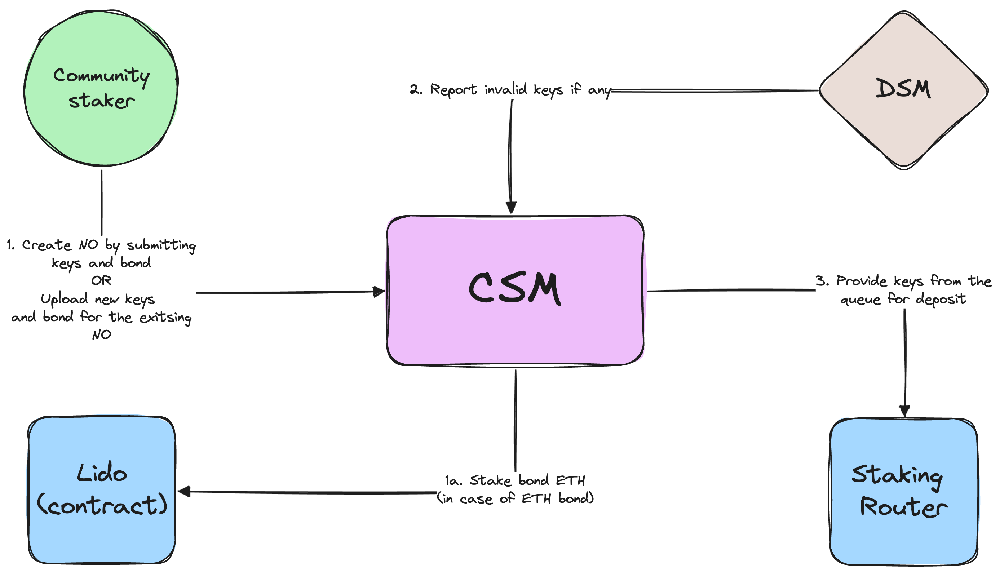
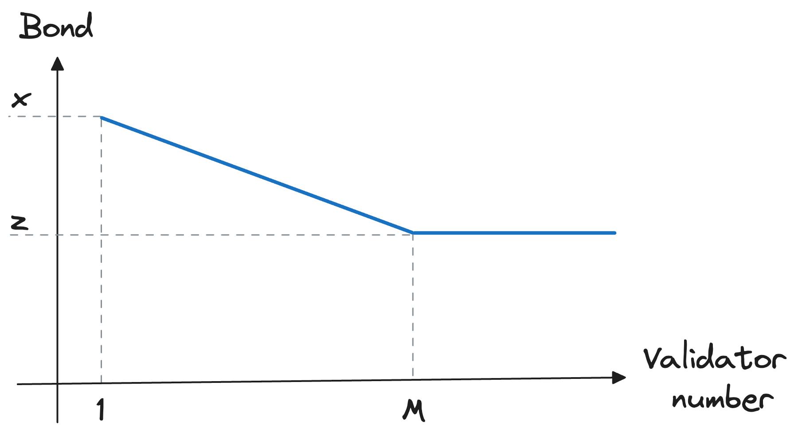
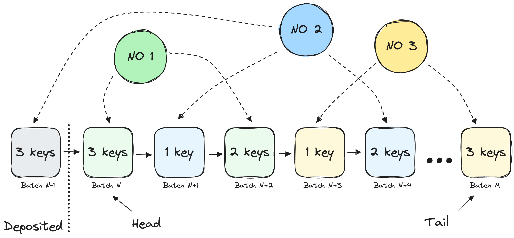

# Join CSM

## Node Operator creation
To become a Node Operator in CSM or register new validators for an existing Node Operator, at least one `validator pubkey`, corresponding [`deposit signature`](https://github.com/ethereum/consensus-specs/blob/v1.4.0/specs/phase0/beacon-chain.md#signingdata), and the corresponding bond amount should be provided. 

## Deposit data preparation and upload
CSM accepts deposit data in the same [format](https://docs.lido.fi/contracts/node-operators-registry#addsigningkeys) (`validator pubkey` + `deposit signature`) as the Curated module, with the main difference being a requirement to submit the bond prior to or alongside deposit data upload.

[`deposit signature`](https://github.com/ethereum/consensus-specs/blob/v1.4.0/specs/phase0/beacon-chain.md#signingdata) **must** sign the root of the `(deposit_message, domain)`. Where a `domain` is used to identify the chain, and `deposit_message` has the form of the following tuple:
- `validator pubkey`;
- `withdrawal_credentials` with actual [`Lido Withdrawal Vault contract`](https://docs.lido.fi/contracts/withdrawal-vault) address;
- `32 ETH amount`;

## Bond

> Here and after, the term 'bond' has the following meaning:
> 
> **Bond** - a security collateral that Node Operators must submit before uploading validator keys into CSM. This collateral covers possible losses caused by inappropriate actions on the Node Operator's side. Once the validator exits from the Beacon chain and all losses that occurred are covered, the collateral can be claimed or reused to upload new validator keys.

A bond is a property of a Node Operator, not a validator. Bond is stored in the form of stETH. Node Operators can submit bond tokens in ETH, stETH, and wstETH. Provided ETH is staked, and wstETH is unwrapped during submission to ensure stETH is the only form of a bond.

The total amount of the bond required depends on the total number of Node Operator's validators and has the form of a function [`getBondAmountByKeysCount(keysCount)`](https://github.com/lidofinance/community-staking-module/blob/main/src/abstract/CSBondCurve.sol#L92)

The graph above can be redrawn for the reader's convenience concerning the validator number, not total validators.

There might be several bond "curves" (`getBondAmountByKeysCount` function implementations). A default curve is assigned to all Node Operators upon creation. The DAO can set a custom curve for the Node Operator.

Existing Node Operators can top-up bond without uploading deposit data to compensate for the penalties or to have bond funds uploaded upfront.

### Unbonded validators
The term "unbonded" is introduced to refer to the validators for which the bond does not fully cover this validator. Taking into account the approach when the bond is common for all Node Operator's validators, unbonded validators can be determined in a way illustrated below. In the example, validator N+1 is unbonded.

### Possible negative stETH rebase consequences
With the bond being stored in stETH, there is a risk of a reduction in the bond amount due to a negative stETH rebase. This might result in some Node Operators being unable to claim rewards (due to the actual bond being lower than required) or even validators becoming unbonded. This problem is described in detail in [Bond Mechanics in Lido ADR](https://hackmd.io/@lido/BkAP1ie86). For this document, it is worth mentioning that no additional actions are required for CSM due to the low probability of the negative stETH rebase and a dedicated [fund](https://etherscan.io/address/0x8B3f33234ABD88493c0Cd28De33D583B70beDe35) at the Lido DAO's disposal for possible use as cover.

## Deposit data validation and invalidation (aka vetting and unvetting)
Given the upcoming [DSM v1.5](https://hackmd.io/@lido/rJrTnEc2a) upgrade, CSM will utilize an [optimistic vetting](https://hackmd.io/@lido/ryw2Qo5ia) approach. Uploaded deposit data will be treated as valid unless DSM reports it is not. In case of invalid deposit data detection, DSM calls `decreaseOperatorVettedKeys` to set `vettedKeys` pointer to the deposit data prior to the first invalid deposit data. In this case a Node Operator should remove invalid keys to resume stake allocation to the valid non-deposited keys.

## Depositable keys
Several factors determine if the deposit can be made using corresponding deposit data. This information is reflected in the Node Operator's `depositableKeys` property. This property indicates the number of deposit data records extracted sequentially starting from the last deposited record available in the Node Operator's key storage for deposits by the staking router. This number is determined as follows:
-   `targetLimit` is not set -> `vettedKeys - depositedKeys - unbondedKeys`
-   `targetLimit` is set -> `min(vettedKeys,targetLimit) - depositedKeys - unbondedKeys` or 0 if the Node Operator has `stuckKeys != 0`.

## Stake allocation queue

The stake allocation queue in CSM is a traditional [FIFO](https://en.wikipedia.org/wiki/FIFO_(computing_and_electronics)) (first in, first out) queue. Node Operators occupy places in the queue with the `{noId, keysCount}` batches and wait for their turn. 

Once the queue reaches the Node Operator's batch, CSM checks how many keys from the batch can be deposited using the formula: `min(depositableKeys, keysInBatch)`. 

There might be a case when a Node Operator has keys that are not in the queue since they were skipped during the queue iteration as they were not depositable at the moment of iteration. The `normalizeQueue` method allows Node Operators to place all depositable keys back into the queue.

There are several pointers regarding deposit data storage in CSM. Among the others, there are `totalKeys` and `vettedKeys` pointers. With the optimistic vetting approach, these two pointers should be in sync most of the time (`totalKeys == vettedKeys`), given that there are no reports about the presence of invalid deposit data. Hence, there are two ways for the deposit data to be placed into the queue:
- Once the deposit data is uploaded, if `totalKeys == vettedKeys`;
- After the call of the `normalizeQueue` method, in case some keys were not placed into the queue upon upload (`totalKeys != vettedKeys` at the moment of upload) or were skipped during the queue iterations;

There is a method to check the next `X`elements and remove those containing no depositable keys. These methods are required to ensure queue operation even in catastrophic scenarios resulting in significant queue "pollution" with the non-depositable keys.

A detailed description of the queue is provided in a separate [document](https://hackmd.io/@lido/ryw2Qo5ia).

## Deposit data deletion
The Node Operator might delete uploaded deposit data voluntarily if it has not been deposited yet. The `removalCharge` is confiscated from the Node Operator's bond on each deleted key to cover maximal possible operational costs associated with the queue processing. Deposit data can be deleted in continuous batches (ex., from index 5 to 10).

If the protocol has already deposited the validator related to the deposit data, the Node Operator cannot delete the deposit data. The only way to stop validation duties is to exit the validator on the CL. Once the validator is fully withdrawn, the Node Operator can claim the excess bond.

## Early Adoption period

One of the challenges with permissionless entry for the Node Operators with appealing conditions is the possibility of a huge actor occupying all seats in the staking module. To overcome this, an Early Adoption period is proposed as the first stage of the CSM mainnet lifecycle. Using a Merkle proof as an entry ticket to the CSM on the mainnet during the Early Adoption period is proposed. On top of the ability to join, such node operators will be eligible for the "bond discount for the first validator". This will ensure that during the Early Adoption period, proven solo-stakers (from the Rated's list and assessed by the Lido DAO) will be able to join with a small benefit.

Please refer to the [detailed doc](https://hackmd.io/@lido/HyKgaBMj6) to learn more about the mechanics of the Early Adoption period.

## Further reading

- [Rewards](rewards.md)
- [Penalties](penalties.md)
- [Validator exits](validator-exits.md)